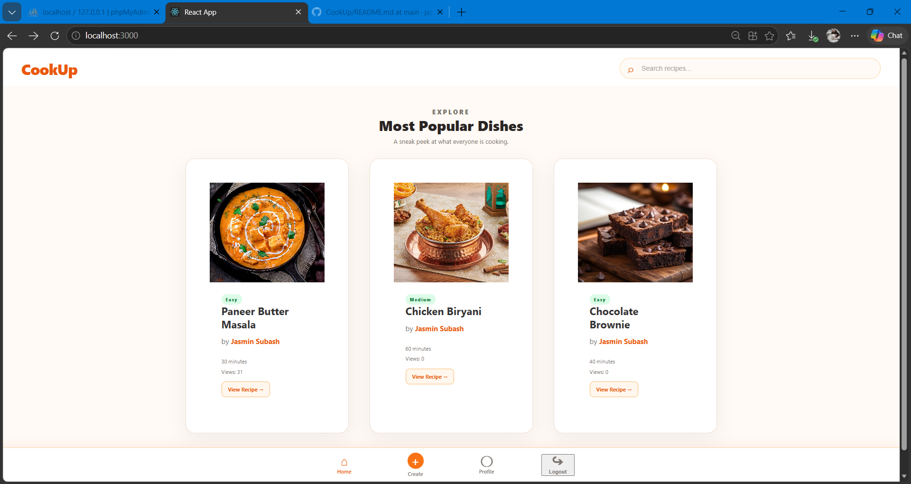

# CookUp – Recipe Sharing Application

CookUp is a full-stack recipe-sharing web application where users can create, manage, and explore recipes, while administrators can manage users and monitor recipe activity.

The application is built using **React.js** for the frontend and **Java Spring Boot** for the backend, with **MySQL/MariaDB** for data storage.

## Features

### User Features

* User registration and login
* User profile management
* Edit profile information
* Change password
* Create recipes
* Edit and delete recipes
* View recipe details
* My Recipes section
* Recipe view counter
* Search recipes by recipe name or chef name
* Most viewed recipes
* Responsive user interface
* Logout functionality

### Admin Features

* Admin login
* Admin dashboard
* View total users and recipes
* View all users
* View user profiles
* Block and unblock users
* Delete users
* View recipe details
* View most viewed recipes
* Manage recipe-related information

## Screenshots

### Home Page



## Technologies Used

### Frontend

* React.js
* JavaScript
* HTML5
* CSS3
* React Router
* REST API integration

### Backend

* Java
* Spring Boot
* Spring Web
* Spring Data JPA
* REST APIs
* Thymeleaf
* Maven

### Database

* MySQL / MariaDB

### Development Tools

* Visual Studio Code
* Spring Tool Suite / Eclipse
* Postman
* MySQL / phpMyAdmin
* XAMPP
* Git
* GitHub

## Project Structure

```text
CookUp/
│
├── backend/
│   ├── src/
│   │   └── main/
│   │       ├── java/
│   │       │   └── com.example.cooking/
│   │       │       ├── controller/
│   │       │       ├── dto/
│   │       │       ├── model/
│   │       │       ├── repository/
│   │       │       └── service/
│   │       │
│   │       └── resources/
│   │
│   └── README.md
│
├── frontend/
│   ├── public/
│   ├── src/
│   │   ├── components/
│   │   ├── Pages/
│   │   └── App.js
│   │
│   └── README.md
│
├── screenshots/
│   └── home.png
│
└── README.md
```

## How the Application Works

```text
React Frontend
      │
      │ REST API Requests
      ▼
Spring Boot Backend
      │
      │ Spring Data JPA
      ▼
MySQL / MariaDB Database
```

The React frontend communicates with the Spring Boot backend through REST APIs.

The backend handles:

* User operations
* Recipe operations
* Authentication
* Profile management
* Recipe views
* Admin operations

Spring Data JPA is used to communicate with the database.

## API Overview

### User APIs

| Method | Endpoint                   | Purpose          |
| ------ | -------------------------- | ---------------- |
| POST   | `/api/register`            | Register a user  |
| POST   | `/api/login`               | User login       |
| GET    | `/api/users`               | Get all users    |
| GET    | `/api/users/{id}`          | Get user details |
| PUT    | `/api/users/{id}`          | Update user      |
| PUT    | `/api/users/{id}/password` | Change password  |
| PUT    | `/api/users/{id}/block`    | Block user       |
| PUT    | `/api/users/{id}/unblock`  | Unblock user     |
| DELETE | `/api/users/{id}`          | Delete user      |

### Recipe APIs

| Method | Endpoint                      | Purpose               |
| ------ | ----------------------------- | --------------------- |
| POST   | `/api/recipes`                | Create recipe         |
| GET    | `/api/recipes`                | Get all recipes       |
| GET    | `/api/recipes/{id}`           | Get recipe details    |
| POST   | `/api/recipes/{id}/view`      | Increase recipe views |
| GET    | `/api/users/{userId}/recipes` | Get user's recipes    |
| PUT    | `/api/recipes/{id}`           | Update recipe         |
| DELETE | `/api/recipes/{id}`           | Delete recipe         |

### Admin APIs

| Method | Endpoint               | Purpose                     |
| ------ | ---------------------- | --------------------------- |
| POST   | `/api/admin/login`     | Admin login                 |
| GET    | `/api/admin/dashboard` | Admin dashboard information |

## How to Run the Project

### 1. Start the Database

Start **XAMPP** and run:

* Apache
* MySQL

Create a database named:

```text
cooking
```

### 2. Run the Backend

Open the `backend` folder in Spring Tool Suite / Eclipse.

Run the Spring Boot application.

The backend runs by default on:

```text
http://localhost:8080
```

### 3. Run the Frontend

Open the `frontend` folder in VS Code.

Install dependencies:

```bash
npm install
```

Start the React application:

```bash
npm start
```

The frontend runs by default on:

```text
http://localhost:3000
```

## Testing

The REST APIs were tested using **Postman**.

The application was tested for:

* User registration
* User login
* Recipe creation
* Recipe retrieval
* Recipe update
* Recipe deletion
* Recipe view counting
* Recipe search
* User profile operations
* Password change
* User blocking and unblocking
* Admin login
* Admin dashboard operations

## Future Improvements

Possible future improvements include:

* JWT-based authentication
* Password reset through email
* Recipe image upload to cloud storage
* Recipe categories
* User favourites
* Recipe ratings and reviews
* Deployment to a cloud platform
* Improved admin authentication and authorization
* Environment-based database configuration

## Purpose of the Project

CookUp was developed as a full-stack application to demonstrate practical experience with:

* React.js frontend development
* Java and Spring Boot backend development
* REST API design
* CRUD operations
* Spring Data JPA
* Relational database integration
* API testing with Postman
* Frontend-backend integration
* Git and GitHub version control

## Author

**Jasmin Subash**

GitHub: [CookUp Repository](https://github.com/jazzjasmin321-ship-it/CookUp)
